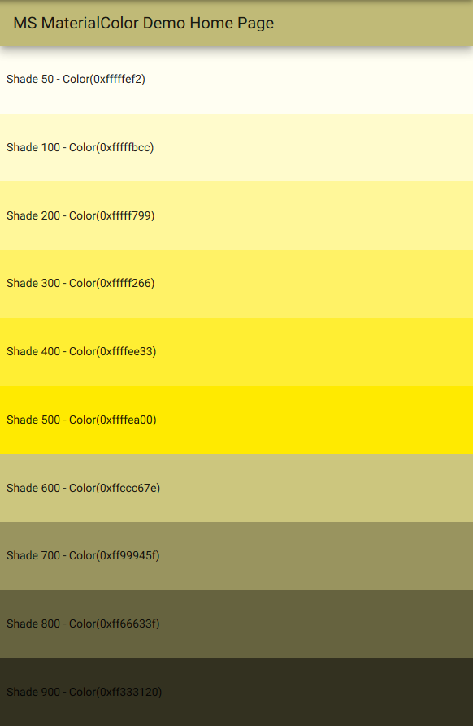

[](https://pub.dartlang.org/packages/ms_material_color)

# Overview

A Flutter lib to simplify creation of MaterialColor with shaders

## Whats MS_Material_Color do

Create a MsMaterialColor and gerenate 10 shader of base color

## Usage

Just import lib and use:

```dart
import 'package:ms_material_color/ms_material_color.dart';

//.. more flutter code here.
@override
  Widget build(BuildContext context) {
    return MaterialApp(
      title: 'Color Demo',
      debugShowCheckedModeBanner: false,
      theme: ThemeData(primarySwatch: MsMaterialColor(0xffffd700)),
      home: MyHomePage(title: 'MS MaterialColor Demo Home Page'),
    );
  }
//.. more flutter code here too, maybe not.
```


